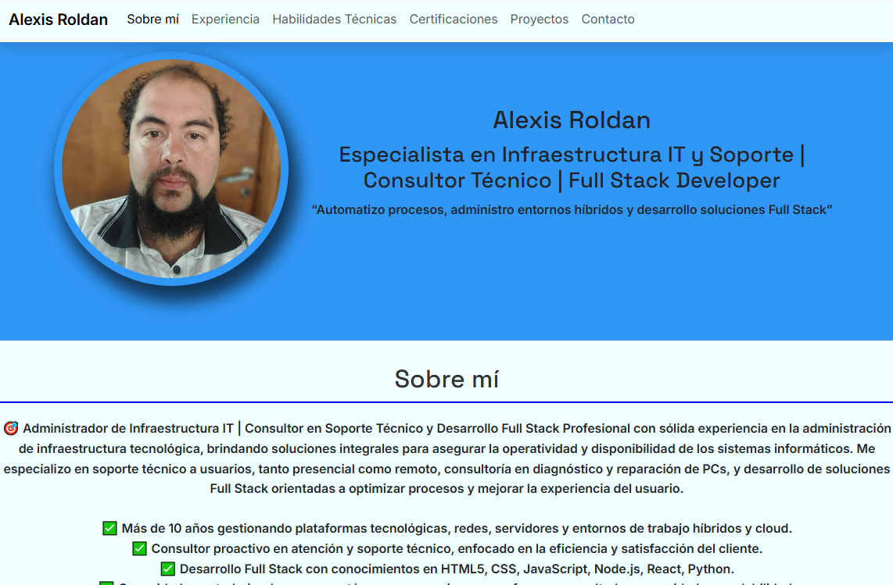

# 💼 Portfolio Personal – Roldán Alexis

Este es mi sitio web personal de portfolio, donde muestro quién soy, mis habilidades y algunos de mis trabajos destacados como desarrollador web. El objetivo de este sitio es presentarme profesionalmente y facilitar el contacto para ofertas laborales.

🔗 Link al portfolio [portfolio-roldan-alexis.netlify.app](https://portfolio-roldan-alexis.netlify.app/)

---

## 🧑‍💻 Sobre mí

Soy **Roldán Alexis**, Administrador en Infraestructura IT, desarrollador con pasión, el diseño limpio y el aprendizaje constante. Este portfolio es una ventana a mi trabajo, mis conocimientos y mi evolución profesional.

---

## ⚙️ Tecnologías utilizadas

- **HTML5**  
- **CSS3**  
- **JavaScript**  
- **Netlify** (hosting)

---

## 🖼 Secciones del sitio

- **Inicio:** presentación general y acceso rápido a secciones de la web
- **Sobre mí:** breve descripción personal y profesional
- **Experiencias** trayectoria de mi experiencia laboral
- **Habilidades Técnicas** descripción de algunas habilidades que practico
- **Certificaciones** certificados que validan mis conocimientos
- **Proyectos:** muestra de trabajos con enlaces a código y demos
- **Contacto:** formulario funcional para enviar mensajes directamente

---

## 📸 Vista previa



## 🧪 Cómo clonar el proyecto

```bash
# Clonar el repositorio
git clone https://github.com/alexlpda1420/Trabajo-Practico-1-Diplomatura-FrontEnd-Developer-999198242.git

